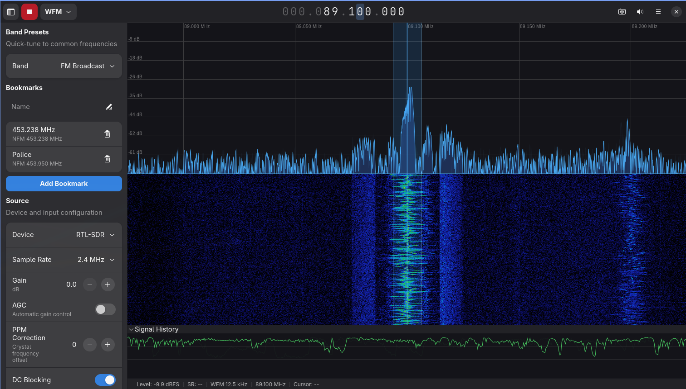

# SDR-RS

Software-defined radio application in Rust -- a port of [SDR++](https://github.com/AlexandreRouma/SDRPlusPlus) with two native UIs: **GTK4 / libadwaita on Linux** and **SwiftUI on macOS 26+**. Both frontends share a single headless engine written in Rust; the macOS app drives it through a hand-rolled C ABI (`sdr-ffi`) and a Swift package (`SdrCoreKit`).



## Features

### Radio

- 8 demodulation modes: WFM, NFM, AM, DSB, USB, LSB, CW, RAW
- RTL-SDR hardware support — pure Rust port of `librtlsdr` (all 5 tuner families) over `rusb` (libusb wrapper)
- TCP/UDP network IQ source and sink
- WAV file IQ playback with looping
- Audio notch filter (biquad IIR, 20-20,000 Hz)
- Auto-squelch with noise floor tracking
- CTCSS tone squelch — 51 standard sub-audible tones (67.0–254.1 Hz), Goertzel-filter detection with neighbor-dominance gating and sustained-hit debouncing; per-bookmark tone selection and threshold tuning
- Voice-activity squelch — syllabic envelope detector (2–10 Hz speech cadence) and SNR-ratio detector (voice-band vs out-of-band power), gates the speaker path alongside CTCSS and power squelch
- Bookmark tuning profiles with full state capture/restore (including CTCSS + voice squelch per-channel)
- **Scanner** — classic sequential scanner (scan-enabled bookmarks, priority channels, configurable dwell/hang, session lockout, empty-rotation recovery). Mutex with recording + transcription so only one is active at a time. F8 toggles the master switch. Manual tune / bookmark recall / demod change auto-stops the scanner.

### Networking

- **rtl_tcp server** — stream the local RTL-SDR over TCP to other machines on your LAN. Single-client model (one user at a time; second connection rejected with FIN). mDNS `_rtl_tcp._tcp.local.` announce so clients find you without typing `host:port`. Compatible with GQRX / SDR++ / any rtl_tcp client.
- **rtl_tcp client** — connect to a remote rtl_tcp server (ours, or stock `rtl_tcp`, SpyServer TCP, etc.). Live mDNS browser lists servers on the LAN; pin favorites for one-click reconnect with last-connection metadata (tuner, gains) shown in the favorites menu. Auto-reconnect on transient network blips.
- **Optional LZ4 stream compression** — between two sdr-rs peers, the rtl_tcp server and client negotiate LZ4 on the data stream via a backwards-compatible `RTLX` handshake. Wire-compatible with every vanilla client (default off; opt in per-server from the "Share over network" panel). Useful on Wi-Fi / hotel / congested links where uncompressed 2.4 Msps saturates the pipe; mDNS advertises `codecs=` so compression-capable clients know when to send the extended hello.

### Display

- Cairo-rendered FFT spectrum plot and scrolling waterfall
- Frequency axis with smart Hz/kHz/MHz/GHz labels
- Spectrum zoom (scroll to zoom, clamped to FFT bandwidth)
- VFO overlay with drag-to-tune and bandwidth handles
- Floating "Reset VFO" button when bandwidth or offset drifts from defaults; per-field bandwidth reset icon on the spin row for one-dimension undo
- Configurable FFT size, window function, colormap, and dB range

### Recording

- Audio WAV recording (48 kHz stereo, IEEE float 32-bit)
- IQ WAV recording (raw pre-decimation samples)
- Waterfall PNG export with desktop notification and click-to-open

### Transcription

Two mutually exclusive backends, selected at build time (see the install section below):

**Whisper backend** — OpenAI's Whisper via `whisper-rs`, multilingual, mature GPU support
- 6 model sizes: tiny (75 MB), base (142 MB), small (466 MB), medium (1.5 GB), large-v3 (3.1 GB), and **large-v3-turbo** (1.6 GB, ~8× faster than large-v3 with near-equivalent English accuracy)
- Optional GPU acceleration: CUDA (NVIDIA), ROCm/HIP (AMD), Vulkan, Metal
- RMS-gated chunked inference with configurable silence threshold

**Sherpa-onnx backend** — k2-fsa's sherpa-onnx, English only (today), streaming + offline
- **Streaming Zipformer** — true real-time transcription with word-by-word live captions
- **Moonshine Tiny / Base** — UsefulSensors' edge-optimized offline models (27M / 61M params)
- **Parakeet-TDT 0.6b v3** — NVIDIA, #1 on the OpenASR leaderboard (600M params, highest accuracy)
- **Runtime model swap** — change models from the dropdown without restarting the app
- **Live captions with display mode toggle** — streaming models render an in-place italic line below the commit log; user can switch to "Final only" mode
- **Silero VAD** — offline models use Silero voice activity detection with a user-tunable threshold slider for noisy RF audio (NFM/scanner)
- **Auto Break segmentation** — with an offline transcription model on an NFM channel, Auto Break segments long recordings on squelch-closed edges so each transmission becomes its own transcript commit instead of a wall of text. The toggle appears automatically when both conditions are met.
- Auto-downloads models and VAD on first use with a bundled progress splash

**Both backends share:**
- Slide-out transcript panel with timestamped commit log
- FFT-based spectral noise gate preprocessor for cleaner recognition
- Volume-independent audio tap (transcription unaffected by volume knob)
- Settings lock during active session to prevent mid-session configuration races

**Apple SpeechAnalyzer backend (macOS app only)** — on-device, Neural-Engine accelerated, ships with the OS
- Uses Apple's `SpeechAnalyzer` + `SpeechTranscriber` frameworks (WWDC 2025, macOS 26+)
- Zero binary bloat — no model download beyond the small locale asset, which the OS fetches on first use
- Live partial + finalized results in the right-side transcript panel
- Privacy: on-device inference, no network path
- Independent of the Linux Whisper / Sherpa stack — they remain the Linux transcription path

### Integration

- [RadioReference.com](https://www.radioreference.com) frequency database browser — search by ZIP code, browse by category/agency, import as bookmarks (requires RadioReference premium account)
- Secure credential storage via OS keyring (GNOME Keyring / macOS Keychain)
- Preferences window with directory settings and account management
- PipeWire audio output (Linux), CoreAudio output (macOS — device picker in Settings)
- Desktop notifications (GNotification) with click-to-open

### Under the Hood

- 22-member workspace (root binary + 21 library crates) with clear dependency boundaries
- Pure DSP functions (no threading, no I/O, no side effects)
- Zero per-frame heap allocations on hot paths
- Lock-based SPSC audio ring buffer between DSP and audio threads
- `mallopt(M_ARENA_MAX)` + periodic `malloc_trim` for glibc arena management
- JSON-based configuration with auto-save

## Build

### Dependencies

**Always required:**
- **Rust** — stable 1.95.0 is pinned via [`rust-toolchain.toml`](rust-toolchain.toml); `rustup` picks it up automatically on first `cargo` invocation. The workspace is 2024 edition.
- **GTK 4.10+** and **libadwaita 1.5+**
- **PipeWire** development libraries (Linux audio)
- **libusb** (for RTL-SDR USB access)
- **libdbus** (for secure credential storage)

**Whisper backend only** (not needed for Sherpa builds):
- **cmake** + **C++ compiler** (build-time, for whisper.cpp)
- **libclang** (build-time, for bindgen)

#### Arch Linux

```bash
sudo pacman -S gtk4 libadwaita pipewire libusb dbus
# Whisper builds also need:
sudo pacman -S clang cmake
```

#### Ubuntu / Debian

```bash
sudo apt install libgtk-4-dev libadwaita-1-dev libpipewire-0.3-dev \
  libusb-1.0-0-dev libdbus-1-dev
# Whisper builds also need:
sudo apt install libclang-dev cmake g++
```

#### macOS (Linux-GTK build on macOS — not the native Mac app)

```bash
brew install gtk4 libadwaita libusb
# Whisper builds also need:
brew install llvm cmake
```

For the **native SwiftUI macOS app** (recommended on Mac), skip the GTK install and jump to [`macOS native app`](#macos-native-app) below — it doesn't use GTK at all.

### Compile

```bash
cargo build --release
```

### Install

```bash
make install
```

Installs the binary, desktop entry, and icon for app launcher integration.

### macOS native app

The SwiftUI Mac app lives at [`apps/macos/SDRMac`](apps/macos/SDRMac). It's a separate frontend that drives the same Rust engine as the Linux GTK build, via the hand-rolled C ABI at [`include/sdr_core.h`](include/sdr_core.h) and the [`SdrCoreKit`](apps/macos/Packages/SdrCoreKit) Swift package.

**Requirements:** macOS 26+ (Tahoe), Xcode 26+. The Mac app does not use GTK — no `brew install gtk4` needed.

**Build + run (release, recommended for live RTL-SDR — debug builds can't keep up with 2 MSps on macOS):**

```bash
make mac-app          # cargo --release + xcodebuild Release + .app bundle at apps/macos/build/
open apps/macos/build/sdr-rs.app
```

**Debug / development build:**

```bash
make mac-app-debug
```

**Swift-side unit tests:**

```bash
make swift-test
```

**What the Mac app includes today:**

- RTL-SDR source (native libusb driver) — plus network IQ and WAV file playback
- All eight demod modes (WFM, NFM, AM, DSB, USB, LSB, CW, RAW)
- Metal-accelerated spectrum + waterfall renderer
- CoreAudio output with device picker in Settings (Cmd-,)
- Audio + IQ WAV recording
- RadioReference browser (toolbar button → modal sheet, same credential keychain as the Linux build)
- Bookmarks
- **Transcription via Apple SpeechAnalyzer** (right slide-out panel) — uses macOS's built-in on-device speech framework. No Whisper/Sherpa build machinery and no third-party models required; macOS may fetch a small locale asset on first use (handled transparently by the panel, which shows a "Downloading model…" status line while that happens)
- Advanced demod controls (noise blanker, FM IF NR, WFM stereo, audio notch)
- Advanced source controls (DC blocking, IQ inversion, IQ correction, decimation)
- Auto-squelch with noise-floor tracking

**What the Mac app does not (yet) include:**

- CTCSS / voice-activity squelch controls (engine supports them; SwiftUI not wired)
- Splash screen (the Linux build has one; Mac app launches straight to the main window)
- Sparkle auto-update (issue #248)

### Transcription backend (pick one)

Whisper and Sherpa-onnx are mutually exclusive cargo features — you build with exactly one backend. Default is `whisper-cpu`. **Whisper** GPU builds require the corresponding toolkit installed on the build host (CUDA, ROCm, Vulkan SDK), because `whisper-rs` compiles its own kernels at build time. **Sherpa-cuda** is different: `make install` sideloads the required CUDA 12 / cuDNN 9 runtime libraries automatically into `~/.cargo/bin/sdr-rs-libs/` and only needs the NVIDIA kernel driver present on the host — see the Sherpa CUDA notes below.

```bash
# Whisper backend (default) — multilingual, mature GPU acceleration
make install CARGO_FLAGS="--release"                               # Whisper CPU (default)
make install CARGO_FLAGS="--release --features whisper-cuda"       # NVIDIA GPU
make install CARGO_FLAGS="--release --features whisper-hipblas"    # AMD ROCm
make install CARGO_FLAGS="--release --features whisper-vulkan"     # Cross-vendor GPU

# Sherpa-onnx backend — Zipformer / Moonshine / Parakeet, English-only
make install CARGO_FLAGS="--release --no-default-features --features sherpa-cpu"   # Sherpa CPU
make install CARGO_FLAGS="--release --no-default-features --features sherpa-cuda"  # Sherpa + NVIDIA GPU
```

With a Sherpa build, you pick the specific model (Zipformer, Moonshine Tiny/Base, or Parakeet) at runtime from the transcript panel dropdown — no rebuild required, and switching is an in-place recognizer swap.

**Sherpa CUDA notes:**

- `sherpa-cuda` is currently linux-x86_64 only. It builds against the k2-fsa sherpa-onnx prebuilt, which is hard-pinned to an internal onnxruntime 1.23.2 build compiled against CUDA 12.x + cuDNN 9.x. CUDA major versions are not ABI-compatible, so hosts running CUDA 13 (e.g. current Arch Linux) cannot use their system libraries.
- **You do NOT need to install CUDA 12 or cuDNN 9 on your system.** `make install` with the `sherpa-cuda` feature automatically downloads the minimum set of NVIDIA CUDA 12 runtime libraries (cudart, cublas, cufft, curand, cudnn) from NVIDIA's developer redist server and packages them alongside the binary. Your system CUDA install — if any — is untouched.
- **First-build cost:** ~1.83 GB download, ~1.2 GB extracted. Downloads are cached in `$HOME/.cache/sdr-rs/cuda-redist/` (survives `cargo clean`); re-installs are instant. Plus the one-time ~235 MB sherpa-onnx CUDA prebuilt from k2-fsa under `target/sherpa-onnx-prebuilt/`.
- **Install layout:** the binary lives at `~/.cargo/bin/sdr-rs`; the runtime libraries live in an adjacent `~/.cargo/bin/sdr-rs-libs/` subdirectory so they don't clutter `$BINDIR`. The binary's ELF `DT_RPATH` resolves them automatically. Nothing is installed system-wide.
- You still need a working NVIDIA driver installed (`nvidia` / `nvidia-utils` on Arch) — the userspace driver library `libcuda.so.1` comes from the kernel driver package and cannot be redistributed, and it must match your installed GPU hardware.
- During the PR stabilization window the sherpa-onnx crate is pulled from the [jasonherald/sherpa-onnx](https://github.com/jasonherald/sherpa-onnx) fork (branch `feat/rust-sys-cuda-support`), which adds a `cuda` cargo feature to the upstream sys crate. An upstream PR to k2-fsa is planned; once it merges and a release ships, the fork dependency will be swapped back to a crates.io version pin.
- **Deep dive:** see [`docs/cuda-sideload.md`](docs/cuda-sideload.md) for the full rationale, the exact NVIDIA tarballs and versions we pull, how `DT_RPATH` makes the sideload work through `dlopen`, the disk cost breakdown, and the re-unification plan for when upstream catches up. Pre-populate the download cache without running the full install with `make fetch-cuda-redist`.

### Run tests

```bash
cargo test --workspace
```

### Lint

```bash
make lint
```

Runs `cargo fmt --check`, `cargo clippy`, `cargo test`, `cargo deny`, and `cargo audit`.

## Usage

```bash
sdr-rs
```

1. Select a source (RTL-SDR device, network, or file)
2. Set center frequency using the digit selector (scroll or click digits)
3. Choose demodulation mode (WFM, NFM, AM, USB, LSB, etc.)
4. Press **Play**

### Keyboard Shortcuts

| Key | Action |
|-----|--------|
| Space | Play / Stop |
| M | Cycle demod mode |
| F8 | Toggle scanner |
| F9 | Toggle sidebar |
| Ctrl+B | Toggle bookmarks flyout |
| Ctrl+, | Preferences |
| Ctrl+/ | Keyboard shortcuts |

## Architecture

22-member Rust workspace (root binary + 21 library crates) plus a macOS Xcode project that shares the engine via a C ABI:

```text
sdr (binary)              Linux entry point
sdr-ui                    GTK4/libadwaita UI (Linux-only)
sdr-core                  Headless engine facade — cross-platform (Linux GTK + macOS SwiftUI)
sdr-ffi                   Hand-rolled C ABI over sdr-core (drives the macOS app)
sdr-radio                 Radio decoder, demod, IF/AF chains
sdr-pipeline              Threading, streaming, signal path
sdr-dsp                   Pure DSP: math, filters, FFT, demod, resampling
sdr-types                 Foundation types, errors, constants
sdr-config                JSON config persistence + OS keyring access
sdr-rtlsdr                Rust port of librtlsdr (5 tuner families) over rusb
sdr-radioreference        RadioReference.com SOAP API client
sdr-transcription         Whisper / Sherpa-onnx backends + spectral denoiser + Silero VAD
sdr-splash                Cross-platform splash controller (subprocess driver)
sdr-splash-gtk            Linux GTK4 splash window implementation
sdr-source-rtlsdr         RTL-SDR source module
sdr-source-network        TCP/UDP IQ source (including rtl_tcp client)
sdr-source-file           WAV file playback source
sdr-sink-audio            PipeWire/CoreAudio audio output
sdr-sink-network          TCP/UDP audio output
sdr-server-rtltcp         rtl_tcp server — stream local dongle over TCP + CLI binary
sdr-rtltcp-discovery      mDNS _rtl_tcp._tcp.local. announce + browse
sdr-scanner               Classic sequential scanner state machine (pure, no I/O)

apps/macos/
├── SDRMac                   Native SwiftUI app (macOS 26+)
├── Packages/SdrCoreKit      Swift wrapper over sdr-ffi's C ABI
└── SDRMac.xcodeproj         Xcode project
```

**Signal chain:** Source → Decimation → Channel filter → Demodulator → IF chain (squelch) → AF chain → Audio sink

**Transcription tap:** branches off AFTER the demodulator and AF filter but BEFORE volume scaling, so the recognizer always sees full-amplitude audio regardless of what the speaker side is doing. The Linux Whisper/Sherpa path takes 48 kHz interleaved stereo; the macOS SpeechAnalyzer path receives 16 kHz mono f32 from a separate tap the engine downsamples inline — two consumers at the same pipeline junction.

DSP functions are pure (no threading, no I/O). Threading and streaming live in `sdr-pipeline`.

**macOS ↔ Rust boundary:** the `sdr-ffi` crate emits the only `#[no_mangle] extern "C"` symbols in the workspace; it exposes a minimal opaque-handle C API documented in [`include/sdr_core.h`](include/sdr_core.h) and validated byte-for-byte against cbindgen's output on every build (`make ffi-header-check`). The Mac app consumes the static library (`libsdr_ffi.a`) through `SdrCoreKit`, which wraps the C functions in idiomatic Swift (`AsyncStream`, `@Observable`, `async/await`). ABI version is major/minor and carried in both the C header and the Rust code; a compile-time assert keeps them in lockstep.

## RadioReference Integration

SDR-RS can browse and import frequencies from [RadioReference.com](https://www.radioreference.com), the largest radio communications reference source in the US.

**Setup:** Open Preferences (Ctrl+,) > Accounts > enter your RadioReference credentials > Test & Save. A [premium account](https://www.radioreference.com/premium/) is required for API access.

**Usage:** Click the antenna icon in the header bar > enter a US ZIP code > browse frequencies by category and agency > check the ones you want > Import. Frequencies are saved as bookmarks with auto-mapped demod mode and bandwidth.

Your credentials are stored in your system keyring (GNOME Keyring / macOS Keychain) and are only sent to RadioReference.com.

## Responsible Use

> **Disclaimer:** This section provides general information and is **not legal advice**. Consult a qualified attorney for guidance specific to your situation and jurisdiction.

SDR-RS is a personal listening tool for unencrypted radio transmissions. Listening to public safety, amateur, and commercial radio is legal in most jurisdictions, but please use it responsibly:

**It's legal to:**
- Listen to unencrypted radio for personal interest, education, or amateur radio activities
- Take notes for your own reference
- Use the transcription feature to convert audio to text on your local machine

**It's not OK to:**
- Publish or share transcripts of intercepted public safety communications (US Communications Act §605 prohibits divulging or publishing intercepted communications)
- Aggregate or sell information overheard on the radio
- Use information obtained from radio listening to identify, track, harass, or harm individuals
- Decrypt encrypted transmissions
- Listen to cellular phone communications (illegal under ECPA)

**Privacy considerations:**

Public safety broadcasts may include personally identifiable information — names, addresses, license plates, phone numbers. SDR-RS keeps everything local:

- Transcripts live in memory only and are cleared when the app closes
- No data is uploaded anywhere
- All transcription runs on-device — Whisper or Sherpa-onnx on Linux, Apple's Speech framework on macOS
- Audio recordings are saved locally only when you explicitly enable them

If you're using SDR-RS in a shared space, be mindful that others may see the transcript on your screen. Future versions may add automatic redaction of PII patterns and a "lock transcript" mode (see [#219](https://github.com/jasonherald/rtl-sdr/issues/219), [#220](https://github.com/jasonherald/rtl-sdr/issues/220), [#221](https://github.com/jasonherald/rtl-sdr/issues/221)).

**Know your local laws:** Scanner laws vary by jurisdiction. Some US states restrict scanner use in vehicles. Some countries prohibit listening to certain frequencies entirely. It's your responsibility to know and follow the laws where you live.

## Security

See [SECURITY.md](SECURITY.md) for vulnerability reporting and security scanning details.

## License

MIT

## Credits

- [SDR++](https://github.com/AlexandreRouma/SDRPlusPlus) by Alexandre Rouma -- the original C++ application this project ports
- [RTL-SDR](https://osmocom.org/projects/rtl-sdr/wiki) -- the original C library for RTL2832U devices
